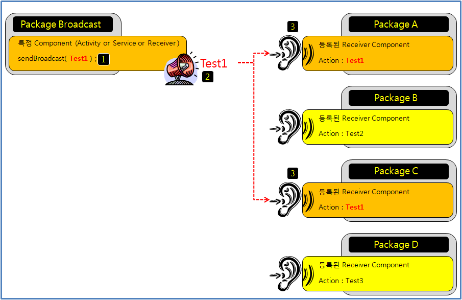
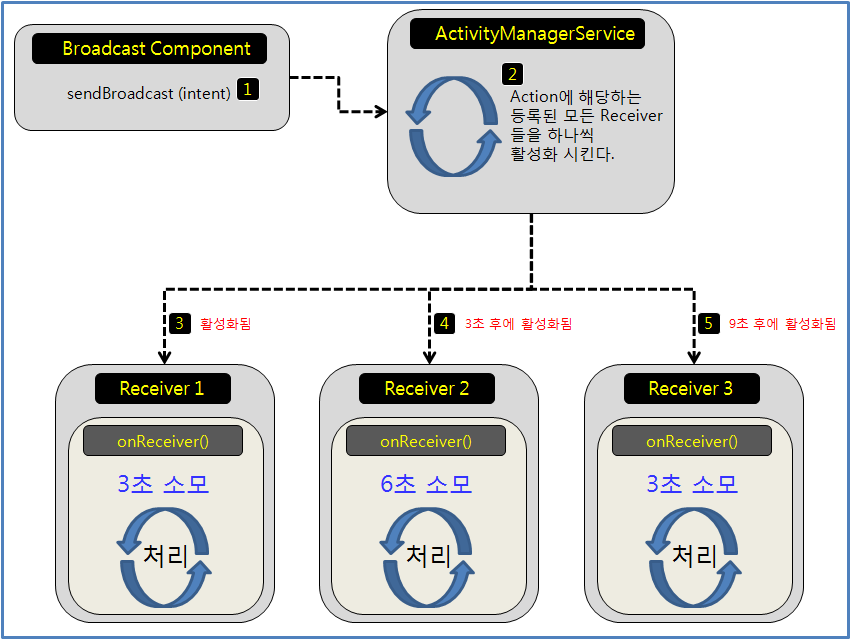
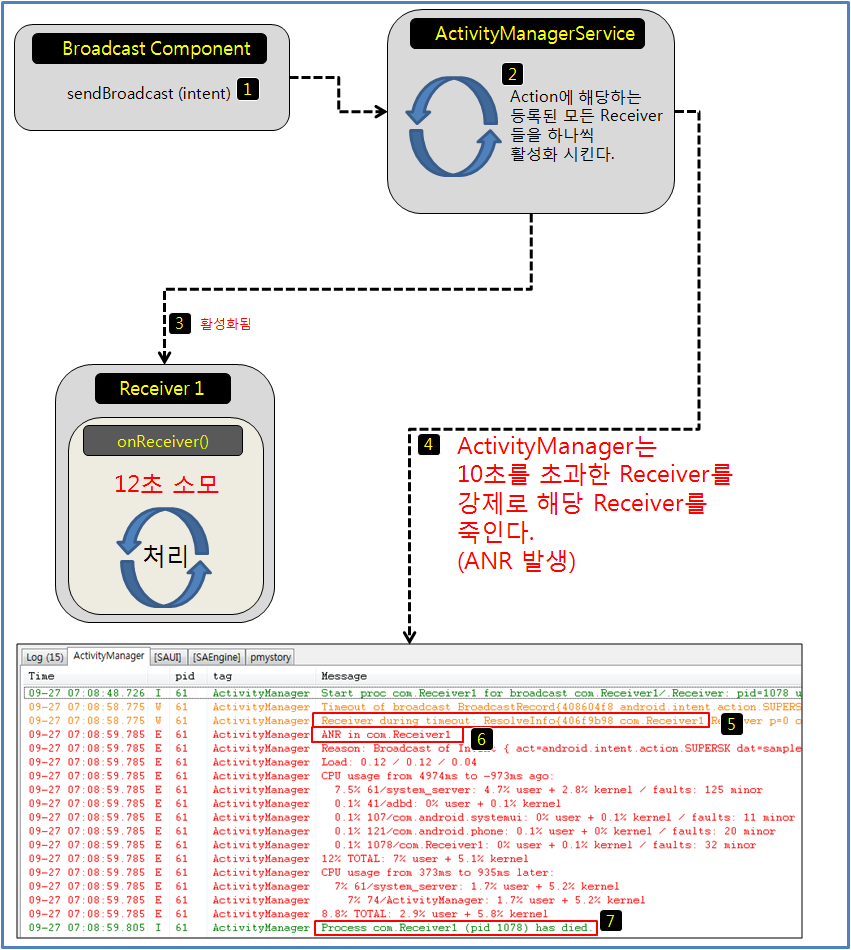
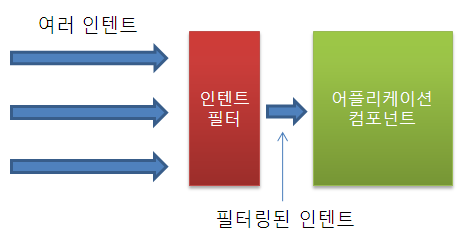
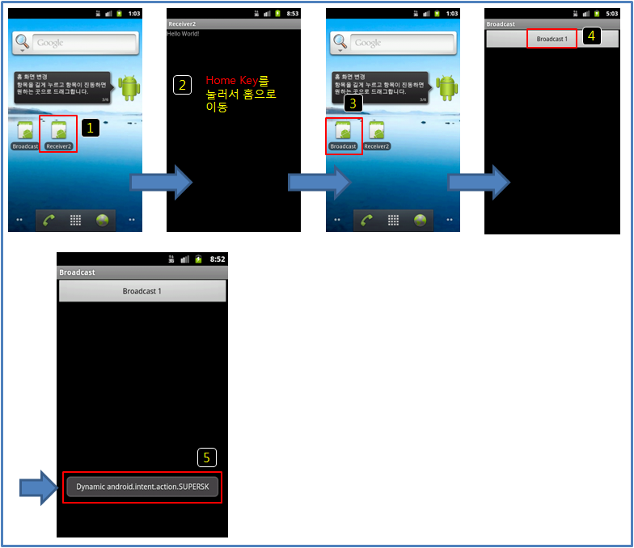
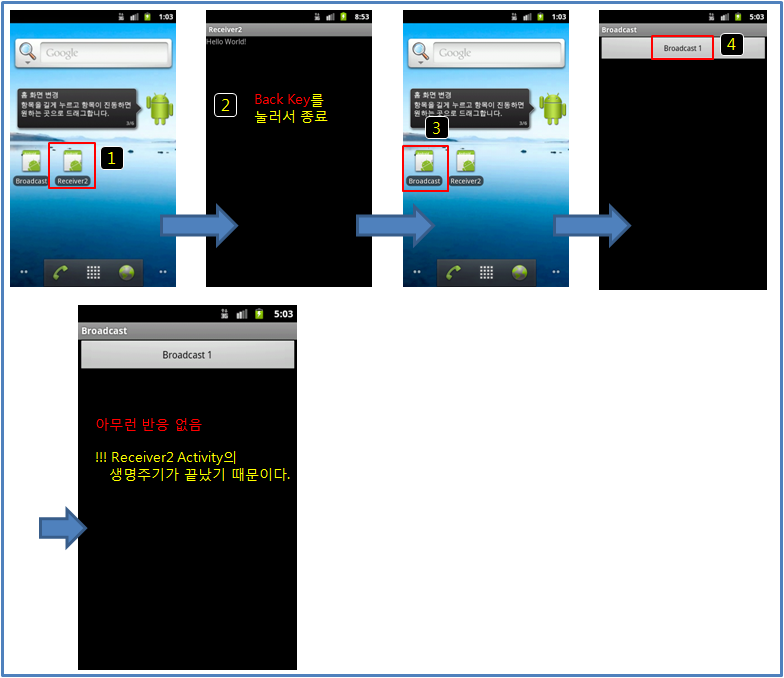
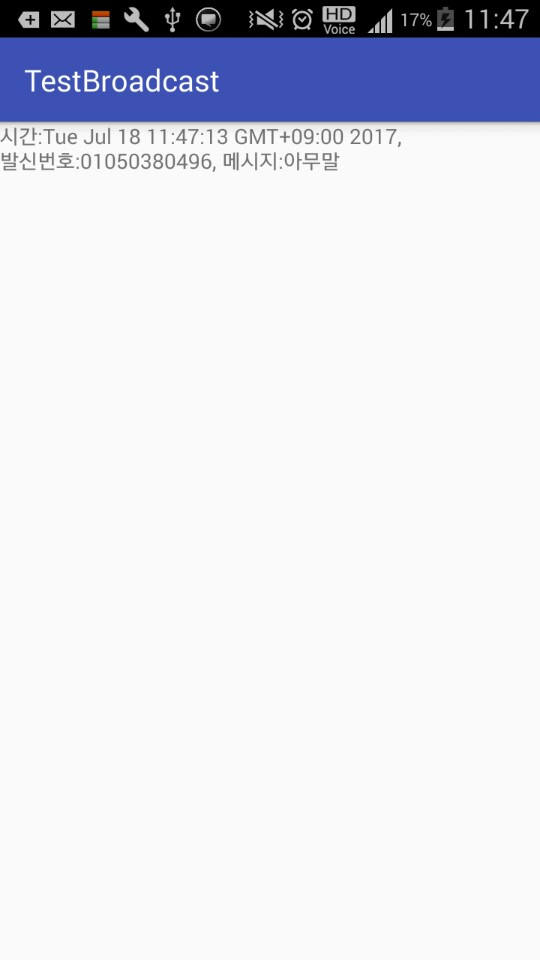

# 브로드캐스트 리시버

## 1. 브로드캐스트리시버의 이해

### 정의

브로드 캐스트 리시버는 옵저버(Observer)패턴을 안드로이드에서 구현한 방식으로 각각의 Component들 간의 메시지를 전달할 수있는 방법을 제공한다.

* 우선 여러 패키지에서 귀를 기울일 만한 방송에 대해 Receiver를 등록한다. 
* 이 Receiver는 자신이 관심을 가지는 방송을 듣게되면 동작하게 된다.

* **옵저버 패턴** : 옵서버 패턴(observer pattern)은 객체의 상태 변화를 관찰하는 관찰자들, 즉 옵저버들의 목록을 객체에 등록하여 상태 변화가 있을 때마다 메서드 등을 통해 객체가 직접 목록의 각 옵저버에게 통지하도록 하는 디자인 패턴이다. 

### 브로드캐스트 리시버 지연 처리
* 브로드 캐스트는 OnReceive() 메소드를 통하여서 수신하게 되는데, 
* 이때 메소드 처리에 10초 이상 걸리는 경우 ANR이 발생하여 프로세스가 강제로 종료된다. 
* 이러한 작업은 ActivityManagerService가 처리하게 되는데
* 수신과정에서 순차적으로(정적 리시버의 경우) Recevier들을 활성화하여 그중 10초가 넘어가는 리시버의 프로세스를 죽인다.
* 동적리시버는 동시에 실행한다. -> 개인적인 생각으로는 컴포넌트에 종속적이므로 UI스레드에서 돌아가기때문.

* **ANR이란?**
ANR은 Application Not Responding의 약자로 그대로 해석해보면 의미를 쉽게 파악할 수 있다. '애플리케이션이 응답하지 않는다.' 인 것이다. 이 에러의 원인은 Main Thread(UI Thread)가 일정 시간 어떤 Task에 잡혀 있으면 발생하게 된다.

* **ActivityManagerService의 경로** : frameworks \ service \ java \ com \ android \ server \ am \ ActivityManagerService.java

### 브로드 캐스트 리시버의 활용

* 리시버는 Activirty 처럼 UI가 존재하지 않는다.
* 그러므로 Background에서 돌아가는 component이다.
	* (Recevier에서는 bindService가 허용되지 않는다. 서비스와 다르다는 것을 인지하자.)
* 리시버는 간단한 작업만 하도록 하자. -> 처리시간 10초 내로 달성하기 위해
	* 다른 component를 활성화 (startActivity or startService 등)
	* DB에 값 변경 등의 onReceiver 함수 내에서만 처리될 수 있는 간단한 작업 만을 처리

### 간단한 브로드캐스트 리시버 사용 흐름

Intent(내용 담기) -> Context의 sendBroadcast()(내용 전파) -> BroadcastReceiver의 onReceiver()(내용 청취)

### 방송 송신
	
* SendBroadcast라는 Context에 포함된 함수를 이용하여 인텐트를 전달한다. 
* Intent에 putExtra를 통해 Integer, boolean, String 등 여러 단일 타입 또는 배열의 혈태로 전달 할 수 있다. 

		Intent sendIntent = new Intent("com.dwfox.myapplication.SEND_BROAD_CAST");
		sendIntent.putExtra("isBoolean", true);
		sendIntent.putExtra("sendInteger", 123);
		sendIntent.putExtra("sendString", "Intent String");
		sendBroadcast(sendIntent);

### 방송 수신

SendBroadcast를 통해 전달된 Intent를 수신하는 리시버(Receiver)를 구현하여야 한다. 리시버에는 
**정적리시버와 동적 리시버**가 있다.

사용 메소드 : 
public abstract void onReceive(Context context, Intent intent);

---
**<잠깐! Intent 전달방식>**

1. 명시적 intent
 
		Intent i = new Intent(FirstrActivity.this, SecondActivity.class);
		startActivity(i);

	intent가 "SecondActivity라는 Class를 호출해라" 라고 명시 해놓고 호출. 이렇게 명시를 해준다면, intent 역시 정해진 곳 만 호출을 하게 됩니다.

2. 암시적 intent
 
		Intent i = new Intent("arabiannight.tistory.com.intentfilter.secondview");
		startActivity(i);

	암시적 intent는 지정된 곳을 호출 하는 것이 아니라 intent에 (action)을 추가해서 **보내고 싶은 명령**을 보내는 것이다. 물론 보내고 싶은 명령을 받아야 할 곳에는 intent에 추가해서 보낸 (action) 값을 추가해 주어야 합니다. 

	**Action**: 서비스 되는 액션의 이름. 액션은 유일한 문자열이어야 하므로 자바 패키지 이름 규약을 사용한다.

	**Action의 종류** - [https://developer.android.com/reference/android/content/Intent.html](https://developer.android.com/reference/android/content/Intent.html)

	**Intent flag를 통한 Broadcast Receiver의 동작 제한**

	* FLAG_EXCLUDE_STOPPED_PACKAGES  
		* 앱이 한번이라도 실행됬을때만 리시버가 동작할 수 있도록 해준다.
		API 12 이후로는 이 플래그는 기본으로 설정된다.
			
	* FLAG_INCLUDE_STOPPED_PACKAGES
		* 한번도 실해되지 않은 앱이라도 리시버가 동작하게 해준다.
		
	* FLAG_RECEIVER_REGISTERD_ONLY
		* 오직 동적리시버만 방송받을 수 있도록 해준다.
		
	* FLAG_RECEIVER_REPLACE_PENDING
		* 동일한 액션으로 중복해서 방송하는 경우 중복된 방송을 제거해준다.
		
---
### <인텐트 필터 동작원리>

## 2. 브로드캐스트리시버 등록 및 제거

BroadcastReceiver를 등록하는 방법은 2가지가 있다. AndroidManifest.xml파일에 receiver태그를 등록하는 정적 리시버와, 동적 리시버가 있다.

#### 1. 정적 리시버 : 한 번 등록하면 해제할 수 없다.

* **등록방법**	
	1. 방송을 수신하고자 하는 앱 내의 AndroidManifest.xml에서 Intent-filter를 선언하여 수신하고자 하는 액션을 정의한다.
	2. 해당 앱 내에 BroadcastReceiver 클래스를 구현하여 onReceive 메소드 안에서 액션 수신 후 동작할 코드를 넣는다.

* **단점**
	* 브로드캐스트 리시버를 해제할 수 없다.
* **장점**
	* 브로드 캐스트 리시버를 한번 등록하면 지속적으로 유지할 수 있다.

* **AndroidManifest.xml** : 해당 액션으로 오는 방송은 모두 수신한다.

		<receiver android:name=".TestReceiver">
		   <intent-filter>
		      <action android:name="com.dwfox.myapplication.SEND_BROAD_CAST"/>
		   </intent-filter>
		</receiver>

* **BroadcastReceiver.java** : 수신처리 클래스

	
		public class TestReceiver extends BroadcastReceiver {
		
		    private static final String TAG = TestReceiver.class.getSimpleName();
		    @Override
		    public void onReceive(Context context, Intent intent) {
		        String name = intent.getAction();
		            // Intent SendBroadCast로 보낸 action TAG 이름으로 필요한 방송을 찾는다.
			   if(name.equals("com.dwfox.myapplication.SEND_BROAD_CAST ")){ 
		            Log.d(TAG, "BroadcastReceiver :: com.dwfox.myapplication.SEND_BROAD_CAST :: "
		            + intent.getStringExtra("sendString")); // putExtra를 이용한 String전달
		         }
		}

#### 2. 동적 리시버 : 등록과 해제가 자유롭다.

* **등록방법**	 
	1. 정적 리시버와는 달리 AndroidManifest.xml에 입력하지 않고, 방송을 수신할 컴포넌트안에서 인텐트필터와 BroadcastReceiver 클래스를 설정한다.
	2. 수신할 방송의 액션을 인텐트 필터에 설정하고, 방송을 리시버에서 수신하여 처리할 작업을 코딩한다.
	3. 그 후, Context.registerReceiver를 이용하여 BroadcastReceiver와 Intentfiler를 등록한다. 
	4. Context.unregisterReceiver를 이용하여 BroadcastReceiver를 해제한다.

* **단점**
	1. 등록과 해제를 반드시 해주어야한다. 중복되게 등록하면, 등록된 리시버 모두 동작한다. 또한 해제를 안할 시 메모리 누수 현상이 발생한다.
	2. 컴포넌트에 등록하기 때문에 컴포넌트 생명주기에 따라 동작한다. 즉, 컴포넌트가 살아있을 경우 동작한다. 
			
		* 현재는 onCreate() 등록하였기 때문에, onDestroy()에서 해제하였다. 또한 onResume()에서 등록하여 onPause()에서 해제할 수 있다.

	3. 동적 브로드 캐스트 리시버 생명주기에 따른 제약사항 모습
		1. 생명주기에 따른 실행 성공
		 
		2. 생명주기가 끝남에 따른 브로드캐스트 리시버 실행 불가
		

* **장점**
	1. 등록과 해제를 통해, 시스템이나 앱에 부하를 줄일 수 있다.
	2. Component 내에 소스코드가 존재하기 때문에 컴포넌트의 멤버변수에 접근하여 사용할 수 있다.(물론 Application 객체를 활용하여 정적 브로드캐스트리시버도 접근할 순 있다.)

* **해당 코드**

		public class TestActivity extends Activity {
		 	private static final String TAG = ReceiverVideoFinish.class.getSimpleName(); 
			BroadcaastReceiver mReceiver; 
					
			@Override protected void onCreate(Bundle savedInstanceState) {
			 	super.onCreate(savedInstanceState); 
				//브로드캐스트의 액션을 등록하기 위한 인텐트 필터 
				IntentFilter intentfilter = new IntentFilter(); 
				intentfilter.addAction("com.dwfox.myapplication.SEND_BROAD_CAST"); 
				//동적 리시버 구현 
				mReceiver = new BroadcastRecevier(){
					 @Override 
					 public void onRecevie(Context context, Intent intent)
					 { 
						String sendString = intent.getStringExtra("sendString"); 
						Log.d(TAG, sendString); 
					 } 
				}; 
				//Receiver 등록 
				registerReceiver(mReceiver, intentFilter); 
			} 
			//등록된 Receiver는 반드시 해제 해주어야 한다. 
			unregisterReceiver(mReceiver); 
		}

## 3. 브로드 캐스트 리시버를 활용한 SMS 수신

정적 리시버를 사용하였을 때, xml에서 등록되지 않는 액션들이 있으므로 동적 리시버를 사용하여 등록하겠다.

1. SMS 수신을 위해 사용될 액션
	* **android.provider.Telephony.SMS_RECEIVED** : sms 수신 (RECEIVE_SMS 권한 필요)

2. AndroidManifest.xml에 권한 등록
	* **<uses-permission android:name="android.permission.RECEIVE_SMS" />**

3. MainActivit.java 파일

		BroadcastReceiver myReceiver;
	    TextView smsTextView;
	    @Override
	    protected void onCreate(Bundle savedInstanceState) {
	        super.onCreate(savedInstanceState);
	        setContentView(R.layout.activity_receive);
	
	        // 인텐트 필터 등록
	        IntentFilter intentFilter = new IntentFilter(Intent.ACTION_SCREEN_ON);
	        intentFilter.addAction(Intent.ACTION_SCREEN_OFF);
	        intentFilter.addAction(Intent.ACTION_BOOT_COMPLETED);
	        intentFilter.addAction("android.provider.Telephony.SMS_RECEIVED");
	
	        smsTextView = (TextView)findViewById(R.id.smsTextView);
	
	        myReceiver = new BroadcastReceiver() {
	            @Override
	            public void onReceive(Context context, Intent intent) {
					
					// 해당 액션이 맞으면 수신작업.
	                if ("android.provider.Telephony.SMS_RECEIVED".equals(intent.getAction())) {
	                    Log.d("onReceive()","문자가 수신되었습니다");
	
	                    // SMS 메시지를 파싱합니다.
	                    Bundle bundle = intent.getExtras();
	                    Object messages[] = (Object[])bundle.get("pdus");
	                    SmsMessage smsMessage[] = new SmsMessage[messages.length];
	
	                    for(int i = 0; i < messages.length; i++) {
	                        // PDU 포맷으로 되어 있는 메시지를 복원합니다.
	                        smsMessage[i] = SmsMessage.createFromPdu((byte[])messages[i]);
	                    }
	
	                    // SMS 수신 시간 확인
	                    Date curDate = new Date(smsMessage[0].getTimestampMillis());
	                    Log.d("문자 수신 시간", curDate.toString());
	
	                    // SMS 발신 번호 확인
	                    String origNumber = smsMessage[0].getOriginatingAddress();
	
	                    // SMS 메시지 확인
	                    String message = smsMessage[0].getMessageBody().toString();
	                    Log.d("문자 내용", "발신자 : "+origNumber+", 내용 : " + message);
	
	                    smsTextView.setText("시간:"+curDate.toString()+", 발신번호:"+origNumber+", 메시지:"+message);
	                }
	
	            }
	        };
			// 동적 리시버 등록
	        registerReceiver(myReceiver, intentFilter);
	        Log.d("onCreate()","브로드캐스트리시버 등록됨");
	    }

		//동적 리시버 해제
	    @Override
	    protected void onDestroy() {
	        super.onDestroy();
	        unregisterReceiver(myReceiver);
	        Log.d("onDestory()","브로드캐스트리시버 해제됨");
	    }
	

4. 앱 실행 모습
	
	
